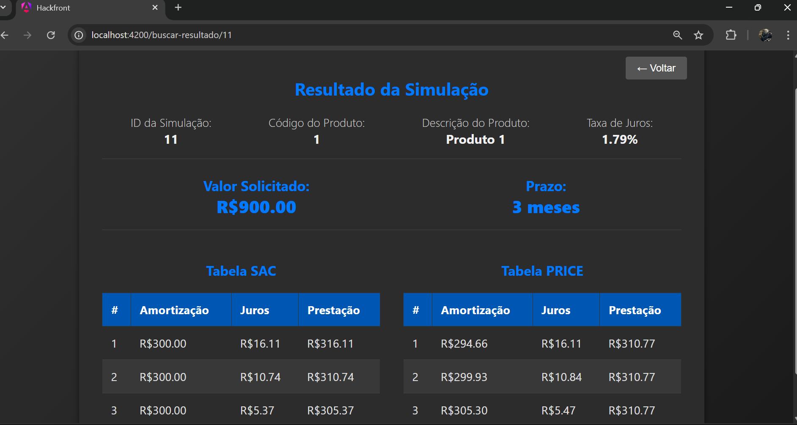

# Frontend | Desafio de Simulação Financeira

Este repositório contém o projeto de frontend desenvolvido em Angular para o hackathon da Caixa 2025. A aplicação tem como objetivo simular propostas de crédito, apresentando os resultados de forma clara e interativa para o usuário.

## Lógica de Negócio e Endpoints

A lógica completa de cálculo e os detalhes dos endpoints da API utilizados por este frontend estão contidos no repositório do backend, que pode ser encontrado no seguinte endereço: https://github.com/CarlosNazario2010/hackathon-caixa-2025

## Exemplo de Screenshots da Aplicação

